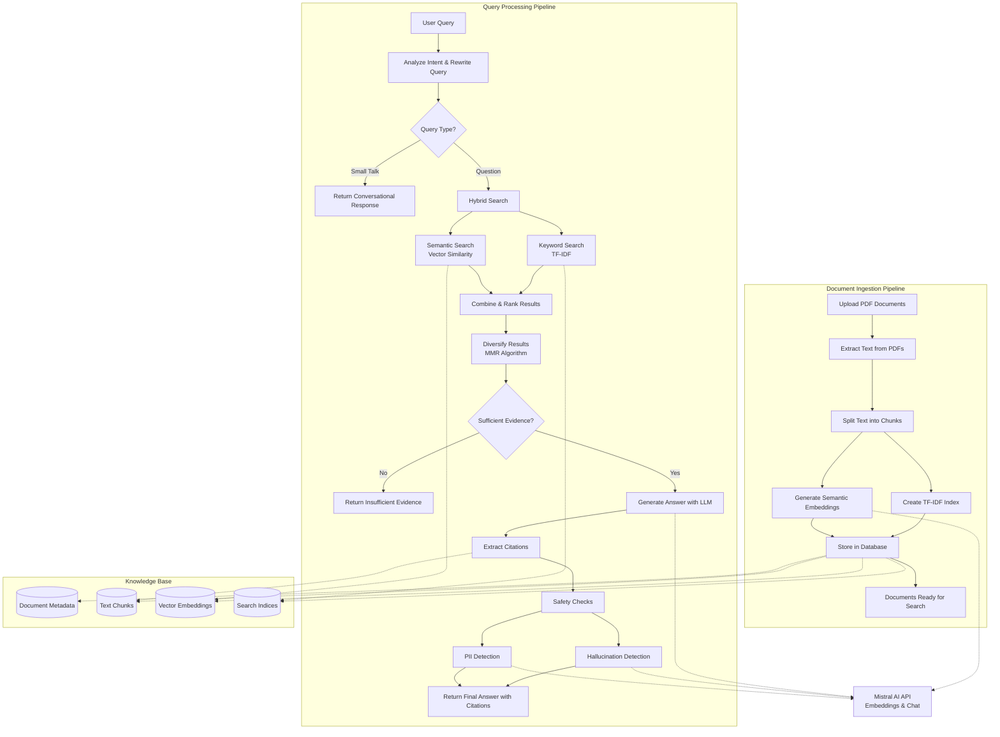

# RAG System Architecture Flow

This diagram shows the high-level flow of the ingest and query endpoints in the RAG system.

## Flow Description

### Document Ingestion Pipeline
1. **Upload PDF Documents**: Users upload PDF files to the system
2. **Extract Text**: Text is extracted from PDFs page by page
3. **Split into Chunks**: Text is divided into overlapping chunks for processing
4. **Create TF-IDF Index**: Keyword search indices are built for each chunk
5. **Generate Embeddings**: Semantic embeddings are created using Mistral AI
6. **Store in Database**: All data is persisted in SQLite database

### Query Processing Pipeline
1. **User Query**: User submits a question to the system
2. **Intent Analysis**: LLM analyzes query intent and rewrites if needed
3. **Query Routing**: Small talk gets conversational responses, questions proceed to search
4. **Hybrid Search**: Combines keyword (TF-IDF) and semantic (vector) search
5. **Result Fusion**: Merges and ranks results using alpha weighting
6. **Diversification**: Applies MMR algorithm to reduce redundancy
7. **Evidence Check**: Validates if sufficient evidence exists to answer
8. **Answer Generation**: LLM generates response based on retrieved context
9. **Citation Extraction**: Identifies and formats source citations
10. **Safety Validation**: Checks for hallucinations and personally identifiable information
11. **Final Response**: Returns answer with citations to user